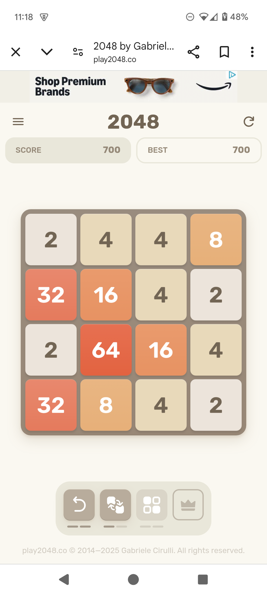

# 2048 OCR Web App

## Overview

A browser-based OCR demo that detects the game board state from a screenshot of the 2048 game using **Tesseract.js** and
**OpenCV.js**. Users can upload a screenshot, and the app will display a recognized 4×4 grid of tile values.

## Features

- Upload and preview a screenshot of the 2048 game
- Detects and segments the game board using OpenCV.js
- Performs OCR on each tile using Tesseract.js
- Displays results in a clean, aligned monospace grid
- Shows real-time debug logs for development and troubleshooting

## Technologies

- HTML, CSS, JavaScript (ES Modules)
- [Tesseract.js](https://github.com/naptha/tesseract.js) – OCR in JavaScript
- [OpenCV.js](https://docs.opencv.org/) – Image processing in the browser
- WebAssembly for performance

## File Structure

- `index.html` – Main UI and logic
- `ocr2048.js` – Handles board detection and OCR
- `opencv.js` – OpenCV runtime
- `tesseract.min.js` – Tesseract runtime

## How to Use

1. Serve the folder locally (e.g. `python -m http.server`)
2. Open `index.html` in a browser
3. Upload a 2048 screenshot
4. View extracted 4x4 grid and logs

## Example Output

<table>
  <tr>
    <td><strong>Input Screenshot</strong></td>
    <td><strong>OCR Output</strong></td>
  </tr>
  <tr>
    <td align="center">
      
    </td>
    <td valign="top">
      <pre><code>🧩 OCR 2048 Board:
   2   4   4   8
  32  16   4   2
   2  64  16   4
  32   8   4   2
</code></pre>
    </td>
  </tr>
</table>

## Notes

- Accuracy depends on clarity and font consistency
- Fully in-browser, no backend required
- Works offline once loaded

## License

MIT
